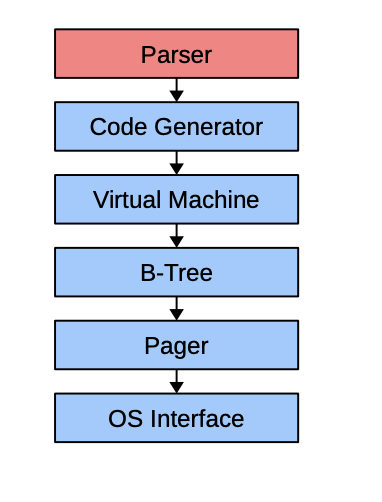
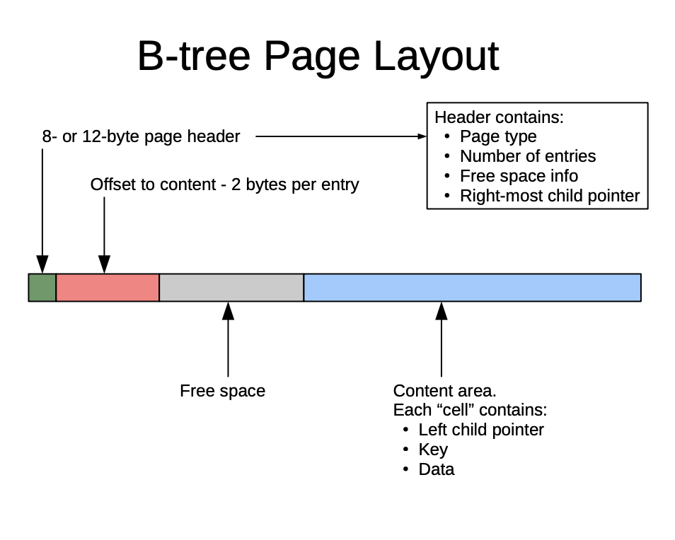

# SQLITE notes

## Link
- (notes)[https://sqlite.org/talks/howitworks-20240624.pdf]

## How things work:

## Notes
- 1 writer
- N concurrent readers
- Not great at:
    - remote data
    - Big Data
    - Concurrent writes

- IN:  compiler compiles code into bytecode
- OUT: VM runs the bytecode

### Code Generator
- Plans query
- Generates bytecode

### Virtual machine
- Executes code

### B-tree
- 1 B-tree for each table and each index
- access via cursor (since there can be multiple per file --> concurrent read/write)
- 64bit integer key rowid + data in "tuple formal"

##### B+tree
- data is only in the bottom most leaf
- data is linked with singly linked list

###### Indexes
- **Dense** - points directly to data
- **Sparse** - points to some probabilistic range

- In **B+tree** dense are use in the last layer while sparse indexes are used for intermediary nodes/leafs

#### B-tree page layout

### Pager 
- atomic commit and rollback

