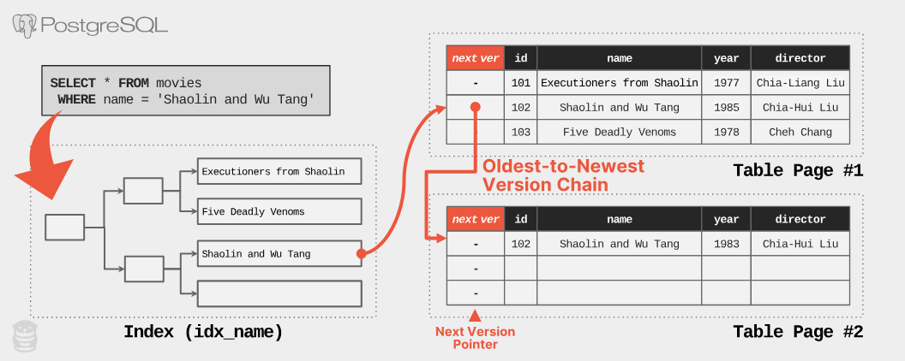

# What we hate about PostgreSQL

## Link:
- [What we hate about PostgreSQL the most](https://www.cs.cmu.edu/~pavlo/blog/2023/04/the-part-of-postgresql-we-hate-the-most.html)
- [Convo - 1](https://chatgpt.com/share/6977199f-23a8-8005-b965-9f196cd9ab46)
- [Convo - 2](https://chatgpt.com/share/697719a0-b550-8005-b788-d881fe931167)

## Notes
- MVCC in PostgreSQL copies whole row even though only 1 column is updated
- To versions there is a traversable index attached to each record pointing to next one:
  - oldest to newest
    - **Pros:**
      - The advantage is that the index (traversing) doesnt have to be updated on every update.
    - **Cons:**
      - To get current version postgre traverses all previous records.
    - **DBs:** PostgreSQL
  - newest to oldest
    - **DBs:** ALL the others

### Data lineage

