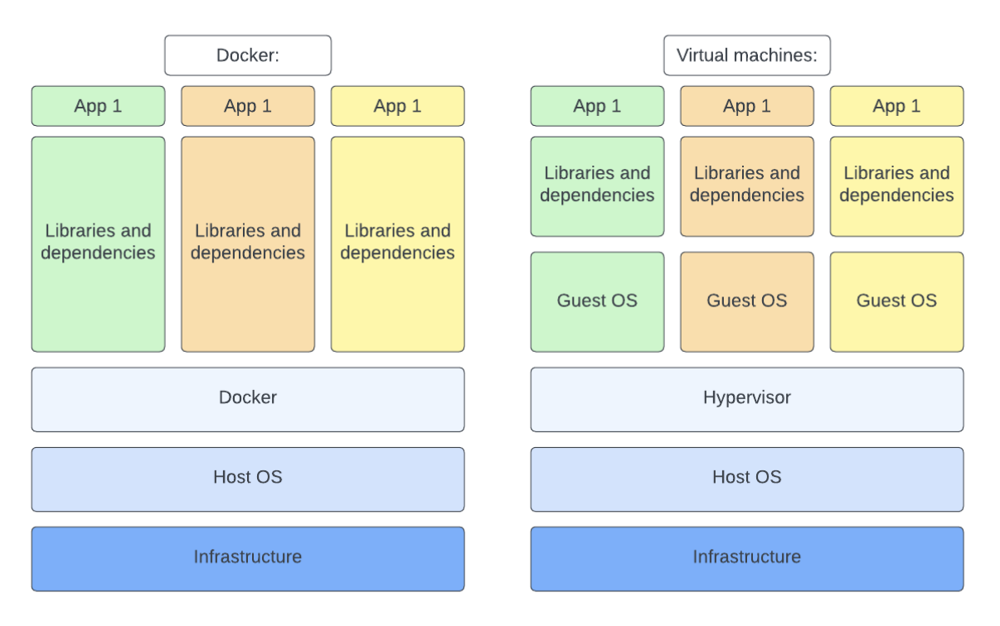
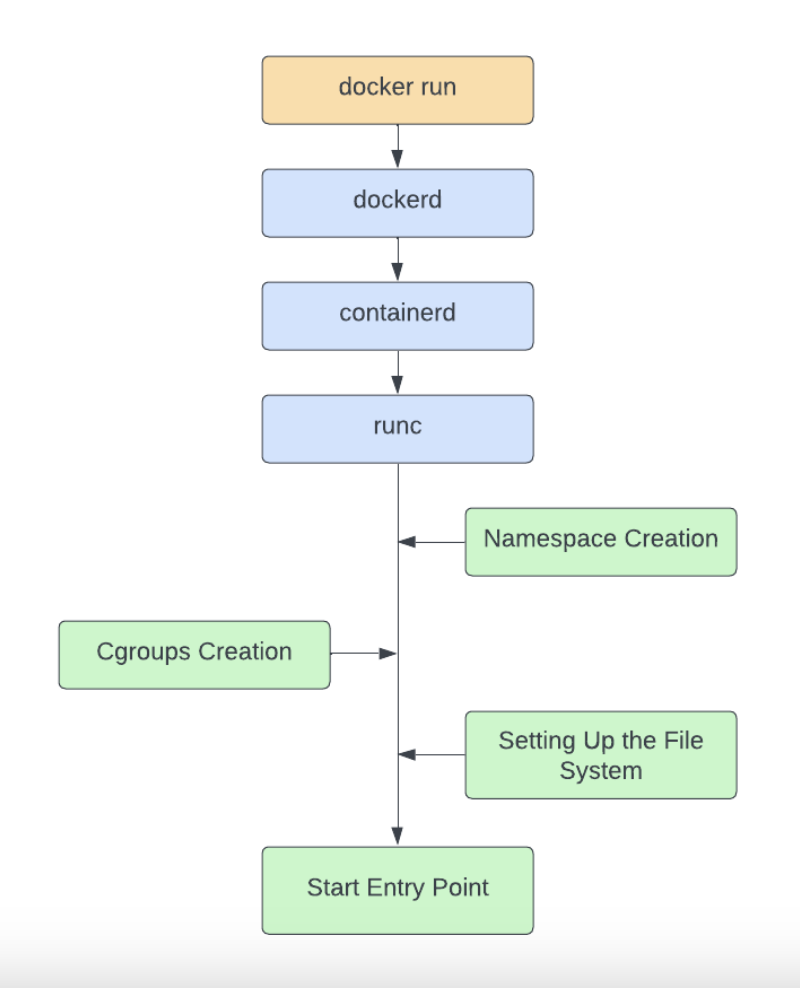

# Docker  - Under The Hood

## Links:
- [https://coursesity.com/blog/docker-interview-questions/](https://coursesity.com/blog/docker-interview-questions/)

## Docker x Virtual Machines

- Virtual machines are more isolated, but heavier
- Docker runs using Linux: `namespaces` and `control groups`
  - This is only in Linux. On Mac/Win there is Linux VM on top of it to be able to run it.

## How it works

**Cgroup**
- Governs bandwidth, IO, CPU memory

**Subsystem**
- manages specific system functions
- memory management, process scheduling
- Each sybsystem has a tree, each running process from

**Example:**

- nginx has 3 running processes
- each has to have some memory limit, some PID etc..

**How to recreate it:**
1. create folder inside cgroups: `/sys/fs/cgroup/my_cgroup`
2. assign some attributes:
   - Create max allowed memory usage:
     - `echo 1073741824 > /sys/fs/cgroup/my_cgroup/memory.max`
   - Assign PID:
     - `echo 1234 > /sys/fs/cgroup/my_cgroup/cgroup.procs`

    
**Namespaces**
- handles isolation of system resources
- namespaces provide a way to group resources together, so that processes running in different 
    namespaces can have their own separate views of these resources, preventing them from interfering 
    with each other.

- **container runtime** - manages lifecycle of containers (start, stop, pull, fetch)
  - communicates with OS that containers are running correctly (safe, secure)
- **Containerd** - standard core container
  - high-level container management pulling management, handles container memory, container execution 
- **runc** - low level container runtime

### How it works when running docker run

- run `docker run` -> request to `Docker Daemon`. That listens to requests and handles CLI request.
- `dockered` checks image local availability. Once its available -> the creation starts.
- `containerd` is and intermediary between high/low level api. 
  - Gets requests from `Docker Daemon`
  - handles lifecycle of images
- `runc` is low-level API and does low level steps:
  - namespace creation
  - cgroups
  - setting up file system

