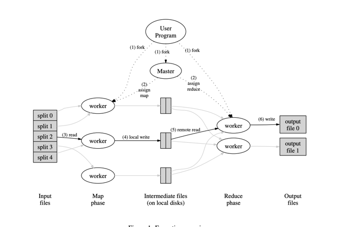

# Map Reduce

## Link
- [Paper Link](https://static.googleusercontent.com/media/research.google.com/en//archive/mapreduce-osdi04.pdf)

## Introduction

### Problems
- before google faced problems with distributing data across compute
- failure handling and reproducing the failed steps

### Solution motivation
- Came across that a lot of tasks were pretty much operations: **map**, **reduce** (primitives from functional languages (Lisp))
  - The motivation was that there were row-wise operations tied to adding some attribute to a key and then reducing the result based on attribute value

## Programming Model
- Map steps groups all the intermediate set of input key/value pairs and produces set of output key/value pairs.
- Reduce takes Map's key/value result (the intermediate output from map). 
  - So that each key has multiple values (list[str]), then it reduces duplicates to shirnk in size and then it applies
      the reduce (filtering) step.r

