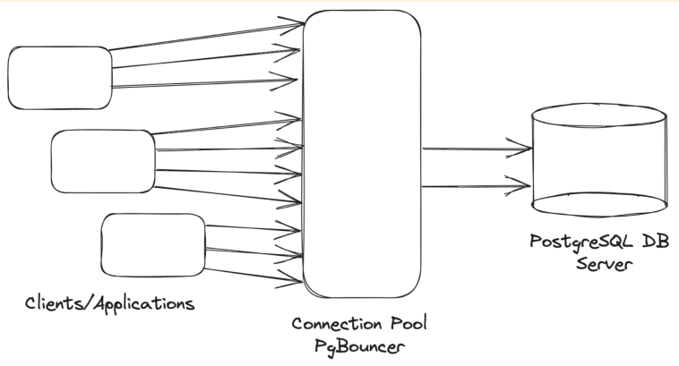
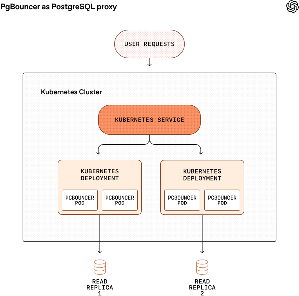

# Scaling PostgreSQL to power 800 million ChatGPT users

## Link:
- [https://openai.com/index/scaling-postgresql/](https://openai.com/index/scaling-postgresql/)
- [Convo - 1](https://chatgpt.com/share/6977199f-23a8-8005-b965-9f196cd9ab46)
- [Convo - 2](https://chatgpt.com/share/697719a0-b550-8005-b788-d881fe931167)

## Motivation:
- At some point there was possibility of overflowing the API with too many requests due to:
    1. perform complex query
    2. other requests timeout -> fallback requests
    3. cache misses

    - This is due to PostgreSQL's: `MVCC`
    
- Sharding database would take months/years to make changes to downstream apps.

## Problems and solutions
1. Heavy write Queries
2. Heavy read Queries
   - joining 12 tables etc.. (OLTP anti-patterns)
3. Queries that have both read and write components
   - Some queries needed to both write and read.
4. Single point of failure
   - There was single writer instance. If this fails then all fails
5. Too many requests for each instance 
    - for millions of users every Azure Cloud PostgresSQL instance have 5k connections
6. Spike in cache misses 
   - surges read time and slows user requests

## Solutions:
 - Separating write and read queries (offload from 1 primary writer)
 - Migrate some write heavy workload to shardable DB (Cosmos)
 - Break down complex queries into smaller, less complex, queries
 - Using pgbouncer for pooling of users
 - Using read replicas to offload read heavy workloads
 - To deliver read requests they use caching layer. To prevent cache miss spikes: 
   - implement lock on cache layers. (only 1 read request that missed can fetch data from Postgres)
 - 

#### PG Bouncer

#### Read replica
