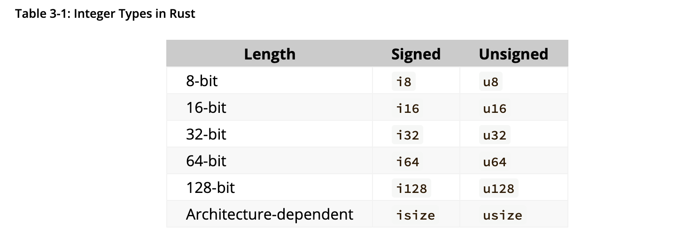

# Common Programming Concepts

## Variables

- Variable
    - Immutable: 
        - the value cant change
        ```rust
            let x = 5;
            x = 6; // Error fail since its immutable
            x = x + 1; // Error fail since its immutable
        ```
    - Mutable: 
        - the value can change
        ```rust
            let mut x = 5;
            x = 6; // Error fail since its immutable
            x = x + 1; // Error fail since its immutable
        ```

- Constant
    - cannot change (be mutable)
    - they live the whole time during the scope
    ```rust
        const THREE_HOURS_IN_MINUTES: u32 = 60 * 3
    ```

## Shadowing
- Shadowing means creating same-named variable after the previous one
    ```rust
        let x = 5;
        let x = x + 1;
        {
            let x = x * 2;
            println!("The value of x in the inner scope is: {x}");
        }

        println!("The value of x is: {x}");

        // OUT: The value of x in the inner scope is: 12
        //      The value of x is: 6
        
    ```

- Its worth noting that you can shadow using let but that is different from mutable changing:
    - You CANNOT mutate variables type.
    ```rust
        // This wil work
        let x = "   "; // string
        let x = spaces.len(); // int

        // This wil NOT work
        let mut spaces = "    ";
        spaces = spaces.len();
    ```

## Basic types

- Rust is statically types: all types must be known at compiled time
- When recasting I must specify type
    ```rust
    let guess: u32 = "  43  ".pars().expect("Not a number!")
    ```

### Scalar types
One of the basic types is scalar which consists of:
    - Integer
    - Floating-point number
    - Boolean
    - Character

#### Integer Type:
- number w/o fractional component.
- default **u32**
    

- Signed x Unsigned:
    - As for does the number have to have a sign.
    - signed:
        - can be negative
    - unsigned:
        - cant be negative

- integers store values in interval: 
    - Singed: $<−(2^{n − 1}) ; 2^{n − 1} − 1>$
    - Unsinged: $< 0; 2^{n} − 1>$

##### Integer overflow
- Integer overflow is when you try to set value to integer outside of possible values (256 for u8)
    - Causes error when compiling
        - to mitigate one can compile with a flag <span style="background:#d1d5db;color:#0f172a;">--release</span> which wraps the integer and shifts its value to accommodate the range (from 0 -> 255 now 1 -> 266).
            - shouldn't be done normally
            - instead explicitly handle with wrapping methods from rust

#### Floating type
- floating point number => number with decimal point

- In rust: f32, f64
- default **f64**

- Implementation:
    ```rust
        let guess = 2.0; //f64
        let guess: f32 = 2.0;
    ```

#### Boolean type
    ```rust
        fn main() {
            let t = true;

            let f: bool = false; // with explicit type annotation
        }
    ```

#### Character types
- char literals use single quotation: ''
- string literals use double quotation: ""

- Implementation:

    ```rust
        let str = 'something';
        let str: char = 'something';
    ```

### Compound types
- compound types store multiple values into one type. In rust two primitives:
    - Tuple
    - Array

#### Tuple
- fixed length
- tuple w/o any value is called **unit**. 
    - It is also an empty return type
- Can have different type in each value

- Implementation:
    - This binds the entire tuple. Its considered a single element.
    ```rust
        fn main() {
            let tup: (i32, f64, u8) = (500, 6.4, 1);
        }
    ```

    - To get individual values using pattern matching using **destructuring**:
    ```rust
        fn main() {
            let tup = (500, 6.4, 1);

            let (x, y, z) = tup;

            println!("The value of y is: {y}");
        }
    ```
    - Program first binds values to tuple variable <span style="background:#d1d5db;color:#0f172a;">tup</span> and then uses matching pattern to match it to params <span style="background:#d1d5db;color:#0f172a;">x</span> , <span style="background:#d1d5db;color:#0f172a;">y</span> , <span style="background:#d1d5db;color:#0f172a;">z</span> 
    - Destructuring here means breaking the tuple into three parts

    - Another way to structure it.:
    ```rust
        fn main() {
        let x: (i32, f64, u8) = (500, 6.4, 1);

        let five_hundred = x.0;

        let six_point_four = x.1;

        let one = x.2;
    }
    ```
    - Here one can access the elements as in python


#### Array
- Unlike Tuple each element MUST have the same type
- Arrays have a fixed length
- Arrays used if one wants to have variables on a **stack**

- Implementation:
    ```rust
        fn main() {
            let a = [1, 2, 3, 4, 5];
            let months = ["January", "February", "March", "April", "May", "June", "July",
              "August", "September", "October", "November", "December"];

            let a: [i32; 5] = [1, 2, 3, 4, 5];  // explicitly stating type and num elements
            let a = [3; 5];

        }
    ```

- to access an element:
    ```rust
        fn main() {
            let a = [1, 2, 3, 4, 5];

            let first = a[0];
            let second = a[1];
        }
    ```

- **Caveat**:
    - if you compile code to access some value upon an input:
        - it will compile
        - if you try to access element not in the range (index 10 for array length 5)
            - you will get an error


## Functions


## Comments

## Control Flow


